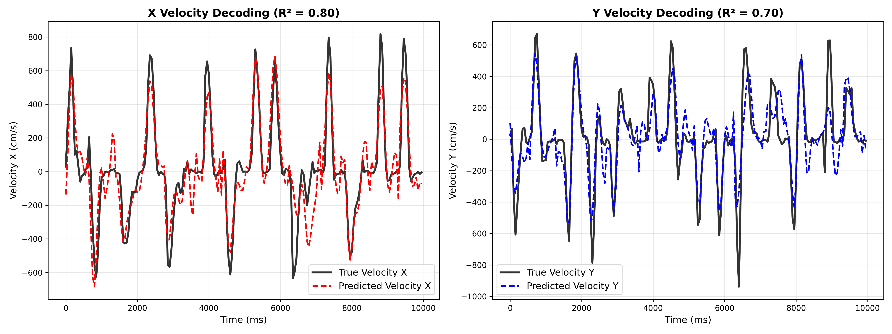

# Neural Kinematics Decoding from M1 Spikes

[](https://opensource.org/licenses/MIT)
[](https://www.python.org/downloads/)

这是一个基于脑机接口（BCI）技术的神经解码项目。项目利用非人灵长类（Monkey Jenkins）运动皮层（M1）的神经元放电数据，实现了对手部运动速度和位置的高精度重建。

## 🚀 项目亮点
- **多模型对比**：实现了岭回归（Ridge Regression）速度解码，并结合了三种位置重建策略（积分法、手动卡尔曼滤波、EM-卡尔曼滤波）。
- **时间动力学建模**：通过构建时延特征（Lagged Features）捕捉神经信号的物理滞后效应。
- **稳健性优化**：通过随机打乱 Trial 顺序有效抵抗长时电极漂移对评估的影响。
- **端到端流水线**：涵盖从 NWB 原始数据读取、高斯平滑预处理到状态空间滤波的全流程。

## 📊 解码表现
在测试集上，本项目达到了以下性能指标：
- **速度解码 (Velocity)**: X-R² ≈ 0.80, Y-R² ≈ 0.70
- **位置重建 (Position)**: 最佳 X-R² 达到 0.92 (基于分段积分与 KF-EM 优化)



## 🛠️ 安装与运行

1. **克隆仓库**:
   ```bash
   git clone https://github.com/your-username/Neural-Kinematics-Decoding.git
   cd Neural-Kinematics-Decoding
